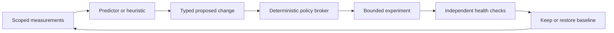

# Learning and Bounded System Optimization

## 1. Answer to the Kernel-Access Question

ecOS can observe local workloads and tune selected resource policies through
existing kernel and runtime interfaces. The proposed production architecture gives
an unprivileged optimizer a typed proposal channel to a narrowly privileged broker.
It does not give a model unrestricted kernel memory access, root shell execution,
module loading or permission to rewrite the running kernel.

Kernel source changes are a separate offline research/release workflow: generate
a candidate, review, build, test in isolation, benchmark, sign and deploy to an
explicit experimental cohort. They are not an ordinary local learning action.

## 2. What Learning Means

| Mechanism | Learns/updates | Initial stance |
| --- | --- | --- |
| Statistics | Arrival rates, memory peaks, latency distributions | First observation implementation |
| Predictive model | Expected demand or cost from scoped features | Offline training/evaluation, then advisory |
| Bounded online selection | Choice among already validated policies | Later controlled experiment |
| Personalization | User preferences or private adapters | Separate opt-in feature |
| Shared foundation-model retraining | Core model weights from endpoint content | Outside scope |
| Kernel code synthesis | New kernel/scheduler implementation | Isolated research only |

Simple heuristics are the baseline. Use machine learning only if it outperforms
them after overhead, variance and failure costs are included.

## 3. Candidate Controls

| Control | Potential benefit | Limit |
| --- | --- | --- |
| ecOS worker concurrency | Avoid oversubscription | Preserve minimum responsiveness and fairness |
| Model residency/prefetch | Reduce cold starts | Fixed memory ceiling and eviction safeguards |
| Batch-size selection | Improve throughput | Application latency constraints |
| Approved device placement | Balance latency/energy | Exact quality, locality and device permissions |
| CPU weights/quotas | Protect interactive work | Broker-managed cgroup envelope |
| Memory limits | Bound background consumption | Tested service minimums and recovery reserve |
| Power profile selection | Reduce energy/thermal load | Hardware-supported profiles; preserve thermal controls |
| Kernel CPU scheduling policy | Research scheduling gains | Dedicated experimental branch and hardware cohort |

Linux cgroup v2 provides hierarchical process/resource controls. It does not give
ecOS a universal per-job GPU preemption mechanism. System services should own the
resource hierarchy and delegate only defined subtrees.
[Kernel cgroup documentation](https://docs.kernel.org/admin-guide/cgroup-v2.html).

## 4. Control Loop

A proposal identifies the target, permitted parameter, old/new values, rationale,
evidence window, policy version, expiration, expected benefit and rollback record.
Authenticate the caller and compare current state to expected state before applying
it. Reject stale proposals and concurrent conflicting changes.

Enforcement validates allowed ranges, rate limits, minimum service budgets, power
conditions and administrator mode. It never executes text supplied by a model as
a command. The optimizer cannot edit the broker policy or its own evaluation data.

## 5. Modes

1. Disabled: static baseline with no optimization telemetry beyond operational needs.
2. Observe: measure with bounded storage; no proposals applied.
3. Recommend: show evaluated candidates to an administrator.
4. Bounded automatic: select permitted reversible settings under a preauthorized policy.
5. Research: isolated experiments with independently controlled recovery.

Automatic mode is not blanket root authorization. A policy can preauthorize a
small range of worker concurrency while forbidding boot, firewall or kernel changes.

## 6. Learning Data and Contamination

Prefer timing, resource and lifecycle features over raw application content.
Scope baselines to user/workload/hardware as needed without exposing one user's
behavior to another. Record feature and policy versions, retention and deletion.

Training on recent activity can normalize malicious or abnormal behavior. Separate
candidate data from an approved baseline, bound contributions from individual
sources, exclude incident windows and freeze adaptation when monitoring integrity
is uncertain. A successful attack cannot become authorized merely through repetition.

## 7. Evaluation and Rollback

Choose one declared objective with constraints: for example, reduce energy per
completed workload while keeping P99 latency and quality within agreed bounds.
Measure CPU cost of learning, memory overhead and thermal effects as well as the
workload result. Never optimize a score that omits user-visible failure.

Use recorded workloads, held-out traces and repeated trials with controlled thermal
state. Compare static baseline, heuristic and learned policy. Canary one parameter
at a time; retain an independently supervised watchdog and a baseline boot profile.

Roll back on missed responsiveness limits, worker crash increases, thermal limits,
telemetry loss, policy expiration or unexplained quality regression. Cooldown and
hysteresis prevent oscillation. Startup after a crash uses the last validated
baseline, not the last attempted experiment.

## 8. sched_ext Research

Linux documents `sched_ext`, a BPF-based CPU scheduling interface with fallback to
the fair scheduler on termination or detected failures. It is a candidate for
future controlled CPU-scheduler experiments. Kernel configuration and scheduler
behavior must be checked for the exact build; cgroup semantics depend partly on
the selected BPF scheduler. Kernel fallback does not prove a policy improves
performance, preserves every quota expectation or controls accelerator scheduling.
[sched_ext documentation](https://docs.kernel.org/scheduler/sched-ext.html).

Only reviewed, versioned scheduler artifacts belong in a signed research release.
The BPF verifier and fallback mechanisms are useful safeguards, not permission to
let arbitrary generated programs define production policy.

## 9. Nonnegotiable Boundaries

Learning cannot disable mandatory access control, signing, audit, encryption or
thermal protections; change trust roots; grant permissions; exfiltrate telemetry;
silently change model semantics; or make the machine unrecoverable without AI.
Security and performance research share a deployment process, not unrestricted authority.
