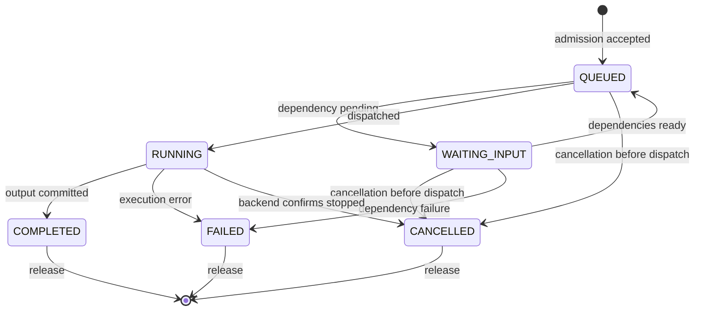

# CogPOSIX: Execution and Capability Contracts

## 1. Purpose and Standardization Status

CogPOSIX is a proposed POSIX-inspired interface for managed inference. It borrows
the discipline of explicit resources, ownership, errors and lifecycle. It does not
claim POSIX equivalence, certification or endorsement, and its handles are not
ordinary file descriptors.

The interface is intended to support independent clients and eventually independent
implementations. A portable source interface, a binary ABI, a wire protocol and
semantic model compatibility are different promises and must be tested separately.

## 2. Contract Layers

| Layer | Defines | Excludes |
| --- | --- | --- |
| Core execution | Sessions, buffers, tensors, models, jobs, events, errors | Semantic meaning of every output |
| Capability profiles | Named task, semantic inputs/outputs, quality and version rules | Kernel or operator implementations |
| Optional extensions | Device memory, graphs, streaming, generation state | Mandatory vendor dependencies in core |
| Backend ABI | Runtime-worker execution adaptation | Application portability guarantees |

## 3. Object Semantics

| Object | Creation and use | Lifetime rule |
| --- | --- | --- |
| Context | Establish an authenticated client session | Destroy stops new requests and begins cleanup |
| Model | Open approved pinned artifact or resolve supported profile | Jobs retain references after client close |
| Buffer | Allocate/import bytes in a declared memory class | Cannot release while tensor/job/transfer references remain |
| Tensor | View with dtype, shape, strides and byte offset | Retains buffer; metadata immutable once submitted |
| Job | Accepted asynchronous computation | Explicit terminal result and release; status remains queryable until release |
| Stream | Ordered submission context | Ordering scope documented; not a token-stream assumption |
| Event | Completion/dependency synchronization | Signals a specified outcome, including failure |
| Graph | Validated finite DAG | Retains its model/profile definitions; invocation owns transient execution state |
| Device descriptor | Inventory and advertised support | Snapshot; availability may change before dispatch |

The numeric handle representation may follow the original 64-bit proposal. A
handle is opaque, session-scoped and type-checked. Stale reuse must be rejected,
not interpreted as access to a newly allocated object with the same slot.

## 4. Public ABI Rules

The canonical boundary is C, with Rust and Python bindings. Freeze binary layouts
only after prototype conformance. Proposed rules for that freeze:

- Use fixed-width integer fields and documented alignment; do not serialize native structs.
- Extensible option/result structs carry size/version and documented defaults.
- Reserved fields must be initialized and unknown required flags must be rejected.
- Specify string encoding, length, lifetime and ownership; no implicit cross-process pointers.
- Specify caller-owned versus library-owned output storage and a release function for each allocation.
- Define thread safety and whether callbacks can reenter the library.
- Define behavior after fork, disconnect and process exit; inherited sessions require explicit handling.
- Separate timeout of a wait call from timeout/cancellation of the underlying computation.
- Expose feature negotiation; an optional extension cannot be assumed present.

Exact signatures and enum values remain design work. The original API names
`cog_model_open`, `cog_infer_submit`, `cog_job_wait` and `cog_job_cancel` describe
the intended surface. A job-release operation is also necessary to bound retained
results; it was not fully specified in the original draft.

## 5. Wire Protocol

The initial local transport uses Unix-domain sockets and an explicitly encoded
binary schema or Protobuf. Select the encoding before implementation and document
message limits, endianness where applicable, framing and descriptor association.

Envelope fields: major/minor version, request ID, opcode, flags and payload length.
Negotiation returns supported features and server limits. Major incompatibility
fails before resource creation. Minor extension behavior must be defined rather
than inferred from a larger message.

Initial operations: HELLO, DEVICE_LIST, MODEL_OPEN/CLOSE, BUFFER_ALLOC/IMPORT/FREE,
TENSOR_CREATE/RELEASE, INFER_SUBMIT, JOB_STATUS/WAIT/CANCEL/RELEASE, CONTEXT_CLOSE.
Sharing, events, streams and graphs are subsequent negotiated surfaces.

Reject oversized lengths, invalid descriptor counts, unknown mandatory fields,
truncated frames and arithmetic overflow without allocating attacker-chosen sizes.
Limit concurrent requests and make cancellation of a waiting client request
distinct from cancellation of an accepted job.

## 6. Tensor Contracts

Describe dtype, rank, extents, strides, offset, layout and access mode. Validate
all reachable bytes against the backing allocation using overflow-checked
arithmetic. Define zero-sized dimensions and alignment requirements. Negative
strides and noncontiguous views may be rejected in the first profile; do not
silently reinterpret them.

Dynamic output shapes require an explicit strategy: caller-provided maximum
capacity with actual shape returned, or runtime allocation with an owned handle.
The first implementation must choose and document one. Never write beyond the
capacity merely because a model predicts more objects than expected.

Initial memory classes are HOST and SHARED. HOST_PINNED, DEVICE and imported
accelerator memory are negotiated extensions. Quantization parameters and semantic
units belong to typed metadata/profile contracts, not guesses based on dtype.

## 7. Job State and Cancellation

A cancellation request may be pending while a job remains RUNNING. The API returns
whether cancellation was accepted, unsupported or already too late. A completion
race has one recorded terminal outcome. Output is invalid unless completion
explicitly marks it valid. Wait timeout leaves the job alive.

For a backend with no safe interruption, cancellation cannot authorize early
buffer reuse. Worker termination is a separately scoped administrative recovery
action that may fail other jobs sharing that worker.

## 8. Scheduling Options

Separate mandatory constraints from preferences. Proposed options include
authorized priority, latency target, deadline, memory ceiling, device preference,
locality, maximum queue time and deterministic-execution profile.

Use a monotonic time base for local scheduling. Absolute deadlines must specify
their clock; remote deadlines need a separate protocol. Report actual placement
and whether preferences were satisfied. Reject unsupported mandatory guarantees.

## 9. Capability Requests

A request for `vision.object_detection` alone is insufficient. The negotiated
profile identifies its version, input conventions, output meaning and evaluation
requirements. The resolver returns the selected model digest, profile and backend
so that selection is auditable. Applications can instead pin an exact package.

Capability resolution is post-MVP. See [the catalogue design](models-and-capabilities.md)
for the semantic contract and controlled substitution process.

## 10. Errors and Diagnostics

Retain the original categories for invalid argument, memory, device, model,
busy, timeout, cancelled, permission, backend, I/O and unsupported errors.
Add documented distinctions for disconnected context, unavailable capability and
constraint mismatch during interface design, without assigning numeric values yet.

Ordinary control flow must not require parsing vendor logs. Diagnostics may carry
backend details, but redact paths and other users' metadata. Bindings must preserve
the stable error category and resource-lifetime implications.

## 11. Conformance and Evolution

Test cross-client ownership, stale handles, malformed messages, bounds, cleanup,
cancel races, timeout semantics, worker failure, version negotiation and unsupported
extensions. Capability conformance additionally tests preprocessing, units, label
sets, output schemas and declared evaluation profiles.

Changing a model without changing an API can still be a behavioral change. Track
artifact version, capability version and core ABI version independently. Require
deprecation periods and a migration example before removing a stable feature.

An open standard needs published governance, an implementable specification and
independent adoption. ecOS-specific administration must not be forced into the
portable inference core to make competing implementations impractical.
