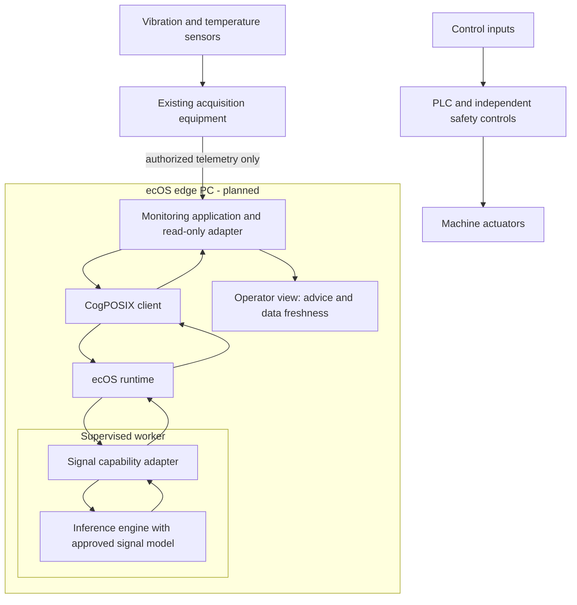
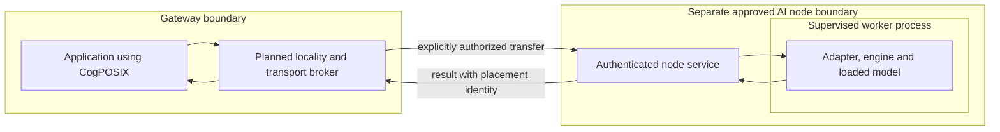

# Deployment Examples: Where, How and Why

Status, 18 September 2026: architecture examples, not delivered OT/IoT products.
Only the local mock and optional pinned digit-classification CPU worker are
implemented. The graphical Live ISO, installed ecOS system, examples below,
accelerator support and distributed fabric remain planned. See the
[implementation evidence](onnx-worker.md) and [delivery roadmap](roadmap.md).

## 1. Read the Architecture Correctly

ecOS >_ CogPOSIX is a next-generation OS project for local, sovereign and offline
AI, with policy-controlled decentralized execution on the roadmap. Its system
interface makes model execution a managed computing capability across desktops,
workstations and edge systems. OT and IoT are two deployment domains within that
broader architecture.

The objective is more secure and efficient AI execution: explicit access to data,
bounded resources and predictable failure handling. Each deployment must validate
those properties against its workload and threat model. In the current
implementation the runtime runs on Linux; the full OS installation experience
remains planned. Installing the runtime on a gateway does not install the OS on
every device connected to that gateway.

| Component | Where it runs | What it does | What it does not do |
| --- | --- | --- | --- |
| Application and acquisition adapter | User or device-service process | Read authorized inputs, construct requests, interpret results | Gain device authority from a model prediction |
| CogPOSIX client | Inside the calling application | Submit typed data and manage model, buffer and job handles | Run a separate inference stage |
| ecOS runtime | Local daemon process | Validate requests, bound resources, manage jobs and supervise workers | Treat arbitrary model output as a privileged command |
| Capability adapter | Inside the supervised worker in the CPU implementation | Convert inputs and validate/convert engine outputs | Discover or control sensors automatically |
| Inference engine and loaded model | Inside that same worker process | Execute the learned computation | Form a second independent service after the worker |
| Kernel and drivers | Computing host | Provide scheduling, memory, transport and device access | Become replaced by an AI model |

The worker is an execution boundary; the engine is a component inside it. The
application and worker exchange data through the daemon, not through a globally
shared address space. Separate process does not mean a complete security sandbox.

The currently implemented example is deliberately small:

1. A client supplies a 28 x 28 U8 image through the current API.
2. The runtime checks its objects and admits the job within bounded resources.
3. The process backend sends an identified request and 784 image bytes by pipe.
4. Inside the worker, the adapter normalizes the image; the already-loaded engine
   executes the pinned digit model and returns scores to the adapter.
5. The adapter checks the output and returns a class from 0 to 9; the backend
   validates the response before completion becomes visible to the client.

This is a classification demonstration, not general OCR or an industrial detector.
Current cancellation or worker failure discards the worker; a later job may start
a fresh one, without silently replaying the failed job. Real sensor types,
timestamps, quality flags and capability-specific schemas need designed adapters
and versioned profiles; arbitrary float sensor arrays are not supported simply
because this example describes them.

## 2. OT: Monitoring an Industrial Motor

### Where to install

Target deployment: ecOS on a supported industrial edge PC near the machine, with
a condition-monitoring application and an approved local model. The PLC retains
its existing control program. Sensors retain their existing acquisition hardware
or firmware. The first pilot uses approved read-only telemetry, not an inference
process connected to a control-write interface.

The diagram deliberately contains no inference-to-actuator arrow. The monitoring
path and the control path have different responsibilities. Actual deployments
require site-specific segmentation, permissions and engineering review; drawing
separate boxes does not establish physical or network isolation.

### How one observation travels

| Step | Owner and action | Boundary or validation |
| --- | --- | --- |
| Acquire | Application adapter reads an authorized telemetry feed | Protocol credentials stay outside the inference worker; no PLC write permission |
| Prepare | Application groups samples into a bounded window | Check device identity, timestamps, units, missing samples and data age |
| Request | Application describes the supported signal profile through CogPOSIX | A future profile must specify shape, dtype, preprocessing and output meaning |
| Admit | Runtime validates handles, resource bounds and model eligibility | Reject unavailable capability or overload rather than inventing a result |
| Compute | Worker adapter calls its in-process engine and loaded model | No actuator credentials, arbitrary shell execution or network fallback |
| Interpret | Application combines the result with quality/freshness checks | A score is not proof of a fault, a calibrated probability or permission to act |
| Present | Operator sees advice with model identity and observation time | Maintenance decisions follow the existing authorized operating procedure |

Example model task: flag an unusual vibration pattern for inspection. Prefer an
ordinary threshold if it meets the requirement; justify the learned model against
that baseline. A numeric alarm threshold must be validated for the actual machine,
not copied from this document.

### Why and what to prove

Potential value: analyze near the data, continue without cloud connectivity, and
use a consistent job lifecycle for additional local applications. These are value
hypotheses, not demonstrated savings or guarantees of hard real-time behavior.

Measure false alarms, missed events, result age, processing delay, resource use
and operator usefulness against labeled site data and a simple baseline. Inject
missing/out-of-order samples, overload, worker crash and network loss. On failure,
show unavailable or stale analysis; never display the last score as fresh evidence.
The existing control and safety behavior must not depend on the inference service.

This is an advisory monitoring example, not a safety controller, autonomous stop
system or recommendation for unattended plant deployment. OT design must account
for safety, reliability and performance constraints. The
[NIST OT security guide](https://csrc.nist.gov/pubs/sp/800/82/r3/final) is a technical
reference for those constraints, not a certification or affiliation of ecOS.

## 3. IoT: A Gateway Serving Sensor Nodes

**Where:** ecOS runs on the capable gateway, not automatically on small sensor
microcontrollers. Battery-powered sensors retain their firmware and send readings
through a supported transport. A future ARM64 gateway needs its own validation;
the first OS preview targets an x86-64 VM.

**How:** a separately permissioned ingestion service authenticates devices and
checks payload size, identity, units and freshness. The gateway application asks
CogPOSIX to classify bounded batches using an approved local profile. Its worker
calls an in-process engine. The application stores or displays the resulting
advice; any outbound summary uses a separately authorized service.

**Why:** avoid an AI integration on every constrained node, centralize model
deployment at the gateway and limit unnecessary upstream data transfer. Sensor to
gateway is already a network boundary: gateway-local inference is not on-sensor
execution or proof that the telemetry transport is confidential.

**Failures and evidence:** limit per-device queues, test spoofed identities,
missing readings, sensor reconnects, stale batches and gateway restarts. Do not
assume exactly-once delivery. Demonstrate retention limits, access separation and
offline behavior. Ingestion connectors, gateway packaging and the sensor model
are not implemented in the current runtime.

## 4. Vision: Inspecting Manufactured Parts

**Where:** an inspection workstation with ecOS connects to a camera through its
normal device driver. The camera does not need CogPOSIX firmware. Start with a
validated CPU profile; GPU/NPU execution requires a separately implemented and
tested backend, driver and model combination.

**How:** the capture application reads a frame and attaches a part/frame identity.
It prepares input for a supported vision profile, submits it through CogPOSIX and
matches the returned result to that frame. Inside the supervised worker, the
adapter performs agreed image transformations and calls the engine. The operator
view displays any detected region and the inspection outcome.

**Why:** share execution conventions across vision tasks without giving the model
camera administration or machine-control privileges. This does not automatically
share model memory between applications or guarantee a fixed inspection latency.

**Failures and evidence:** test camera disconnects, lighting changes, missed frames,
late results and representative defects. Compare with an agreed baseline. Never
apply a late result to the next part. Automated rejection would require a separate
validated control integration; it is not authorized by this example. The current
digit classifier cannot be presented as this defect-inspection model.

## 5. Desktop: Local Document Extraction

**Where:** ecOS runs on the user's workstation. A document application opens only
files the user has authorized. The first graphical demonstration could run in the
planned Live ISO in QEMU; no installer or complete document application exists yet.

**How:** the application renders a page and makes distinct layout, OCR and field
extraction requests where those profiles exist. Each model stage is an actual
successive computation; each engine is still contained within its worker. The
application owns orchestration and intermediate results, and asks a person to
review uncertain fields. Current runtime support does not imply these profiles
or a graph scheduler have been implemented.

**Why:** process documents locally without granting extracted text authority over
files, commands or network access. A conventional parser should handle documents
it can read reliably; model use must provide measurable value.

**Failures and evidence:** preserve page/field provenance, distinguish a missing
field from a failed job, handle malformed files and show reviewable uncertainty.
Evaluate extraction accuracy and correction time on approved samples. Verify
network-disabled operation after model provisioning and keep documents out of
default logs. Retrieval or storing results is not training a model.

## 6. Optional Distribution: Gateway to Approved AI Node

**Where:** the application remains on the gateway; the engine and model run inside
a worker on a separately enrolled AI node. This is a planned deployment and needs
a new authenticated transport and policy layer; the current local socket protocol
does not provide it.

**Why:** use a larger approved compute node when local capacity is insufficient.
Only do so with explicit permission for the data class, recipient and purpose;
the engine does not independently choose a network destination. Local-only policy
must reject this route rather than silently offload. Local pointers and shared
memory descriptors are not remotely valid data transports.

**Failures and evidence:** test identity revocation, partitions, replay, node
unavailability and results arriving after cancellation. A lost connection can
leave execution outcome unknown; do not claim that it proves remote termination.
Read the [distributed design](distributed-intelligence.md) before proposing this
deployment. Data sharing, execution and model improvement need separate grants.

## 7. Deciding Whether ecOS Helps

For each pilot, name the computing host, device owner, application, supported
capability, data class, model version, resource budget, output consumer and failure
procedure. Decide acceptance thresholds with the operator before implementation.

If one conventional algorithm or one directly integrated model already solves
the problem reliably at acceptable cost, a new system layer may not yet be worth
adopting. The hypothesis to test is whether common execution contracts, visible
placement and managed lifecycles reduce repeated integration and operating work.
Neither a diagram nor offline execution alone proves that benefit.
